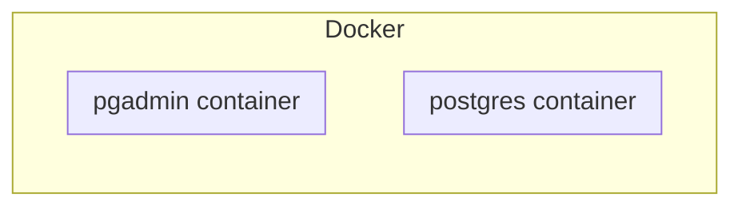

# PostgreSQL with Docker

## Introduction

This README explains how to set up the **LBAW PostgreSQL development environment**.

These instructions guide you through setting up a local development environment with two Docker containers: one for the [PostgreSQL](https://www.postgresql.org/) server and another for [pgAdmin](https://www.pgadmin.org), a web-based graphical user interface for interacting with the database.

Docker is a lightweight virtualization platform that allows you to package and deploy applications and their dependencies as self-contained units called containers. In a nutshell, Docker lets you 'program your infrastructure'. See the [Docker Overview](https://docs.docker.com/get-started/overview) for a more detailed introduction.

To use Docker, the only requirement is to have Docker Desktop installed. You can find installation instructions for all major platforms in the [Get Docker](https://docs.docker.com/get-docker/) page.


## Starting the Docker containers

This repository defines a **docker-compose.yaml file**, which is a configuration file used to define and run multi-container Docker applications.

It configures two services:

* `postgres` – a PostgreSQL 16 server with a default administrator user
* `pgadmin` – a pgAdmin 4 v9 instance, a web-based UI for PostgreSQL

Both container images are pulled from [Docker Hub](https://hub.docker.com), the official container registry.

The following diagram depicts our infrastructure. It is also an example of GitLab's support for [Mermaid](https://docs.gitlab.com/ee/user/markdown.html#mermaid), a tool that renders diagrams from markdown specifications.



To **start the containers**, from the project root run:

```bash
docker compose up -d
```

* This will download the required images (the first time) and start both containers.
* The `-d` flag runs them in detached mode, meaning they keep running in the background while you continue using your terminal.

You can open Docker Desktop dashboard to see if the containers are running as expected. You can also **check the status of the containers** from the command line with the following command:

```bash
docker ps
```

To **stop the containers**, just run the command:

```bash
docker compose down
```


## Working with PostgreSQL

After starting the containers, you can interact with PostgreSQL using either **pgAdmin** or the **psql command-line client**.

### Using pgAdmin 4

Open your browser and navigate to http://localhost:4321. If you encounter any issues with `localhost`, you may need to use the IP address provided by the virtual machine running Docker. Refer to your installation documentation for guidance on this.

Use the following credentials to login:

    Email: lbaw@example.org
    Password: password

In the first use of the development database, you will need to add a new server using the following settings:

    hostname: postgres
    username: postgres
    password: password

Note: We use `postgres` as the hostname instead of `localhost` because Docker creates an internal DNS entry to facilitate connections between linked containers.

### Using the Command Line Client (psql)

To use the command-line client, you need to have PostgreSQL client tools installed on your computer.
The installation process may vary in complexity depending on your operating system.

Once installed, you can interact with PostgreSQL using the command-line client (`psql`) by running the following command:

```bash
psql -h localhost -U postgres
```

In this command:

  * `-h` specifies the **host** to connect to (in this case, localhost),
  * `-U` specifies the **username** to use (in this case, postgres).


Alternatively, you can run the `psql` command inside the 'postgres' container with the following command:

```bash
docker exec -it <postgres container name> psql -h localhost -U postgres
```

Here, replace `<postgres container name>` with the actual name of the container running PostgreSQL. You can list the currently running containers using `docker container ls`.